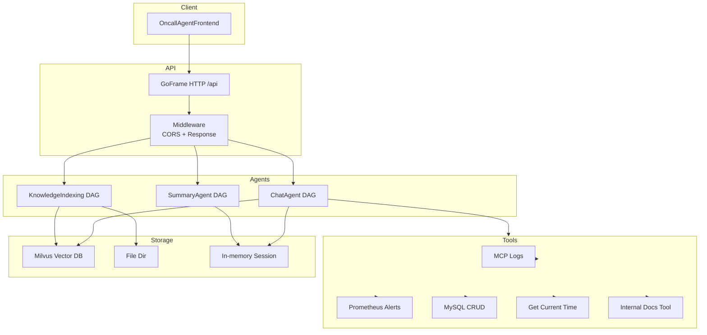

# oncall-agent 架构图

```mermaid
flowchart TD
  subgraph Client
    UI[OncallAgentFrontend]
  end

  subgraph API
    GW[GoFrame HTTP /api]
    MW[Middleware\nCORS + Response]
  end

  subgraph Agents
    ChatAgent[ChatAgent DAG]
    SummaryAgent[SummaryAgent DAG]
    Indexing[KnowledgeIndexing DAG]
  end

  subgraph Tools
    MCP[MCP Logs]
    Prom[Prometheus Alerts]
    MySQL[MySQL CRUD]
    TimeTool[Get Current Time]
    InternalDocs[Internal Docs Tool]
  end

  subgraph Storage
    Milvus[Milvus Vector DB]
    FileStore[File Dir]
    Mem[In-memory Session]
  end

  UI --> GW --> MW
  MW --> ChatAgent
  MW --> Indexing
  MW --> SummaryAgent

  ChatAgent --> Tools
  ChatAgent --> Milvus
  ChatAgent --> Mem

  Indexing --> FileStore
  Indexing --> Milvus

  SummaryAgent --> Mem

  Tools --> MCP
  Tools --> Prom
  Tools --> MySQL
  Tools --> TimeTool
  Tools --> InternalDocs
```

