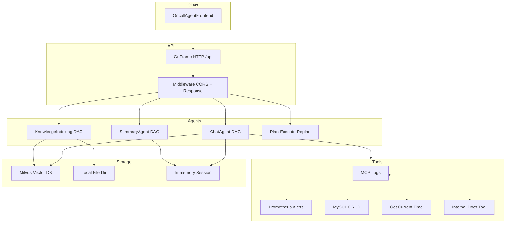
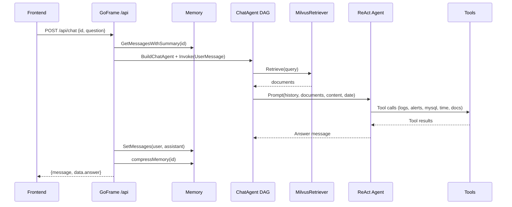
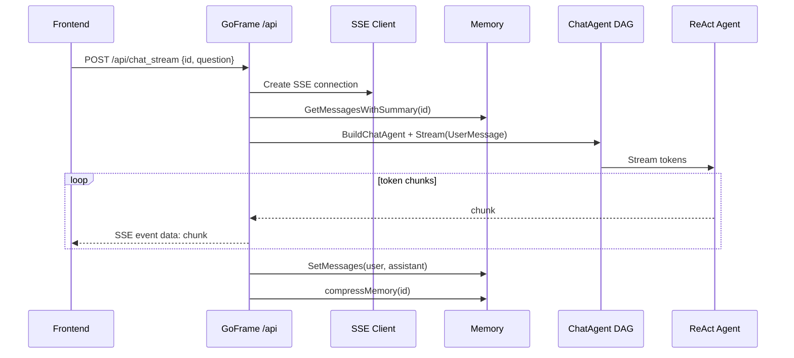
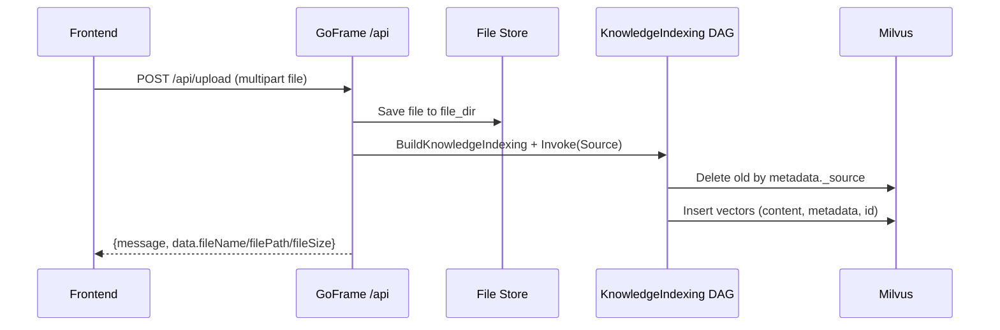
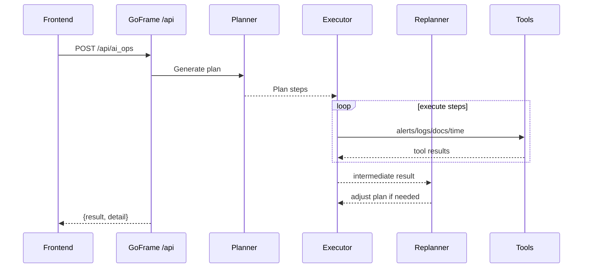

# oncall-agent 深入解读

本文基于当前代码实现，对项目框架、设计、代码实现与核心流程进行深入梳理，并给出后续优化方向。

## 1. 系统概览

系统目标：面向运维/值班场景的智能助手，结合内部文档、监控告警、日志与数据库，输出诊断与处理建议。

核心分层：
- API 层：GoFrame 路由与中间件。
- Agent 编排层：Eino DAG + ReAct Agent。
- 工具层：Prometheus、MCP 日志、MySQL、当前时间、内部文档检索。
- 存储层：Milvus 向量库、本地知识文件、内存对话记忆。
- 前端：静态页面 + SSE 流式交互。

主要入口与目录：
- 服务入口：`main.go`
- API 定义：`api/chat/v1/chat.go`
- 控制器实现：`internal/controller/chat`
- ChatAgent DAG：`internal/ai/agent/chat_pipeline`
- 知识索引 DAG：`internal/ai/agent/knowledge_index_pipeline`
- 摘要压缩：`internal/ai/agent/summary_agent`
- AI Ops：`internal/ai/agent/plan_execute_replan`
- 工具：`internal/ai/tools`
- 记忆：`utility/mem/mem.go`
- Milvus 客户端：`utility/client/client.go`
- 前端：`OncallAgentFrontend/*`

## 2. 运行时架构

## 3. API 层实现

### 路由与中间件
- 入口：`main.go`
- 路由注册：`/api/chat`、`/api/chat_stream`、`/api/upload`、`/api/ai_ops`
- 中间件：`utility/middleware/middleware.go`
  - `CORSMiddleware` 处理跨域
  - `ResponseMiddleware` 统一响应格式 `{ message, data }`

### 请求与响应结构
- 定义：`api/chat/v1/chat.go`
  - `ChatReq`、`ChatRes`
  - `ChatStreamReq`、`ChatStreamRes`
  - `FileUploadReq`、`FileUploadRes`
  - `AIOpsReq`、`AIOpsRes`

## 4. ChatAgent 深入解读

### 4.1 DAG 构建
核心实现：`internal/ai/agent/chat_pipeline/orchestration.go`
- 节点：`InputToRag` → `MilvusRetriever` → `ChatTemplate` → `ReactAgent`
- 并行输入：`InputToChat` 与 `InputToRag` 同时触发
- 触发模式：`compose.AllPredecessor`，确保模板收到检索结果与聊天输入

### 4.2 数据结构与输入转换
- 输入结构：`UserMessage`（`internal/ai/agent/chat_pipeline/types.go`）
- RAG 输入：`input.Query`（`newInputToRagLambda`）
- Chat 模板输入：`{ content, history, date }`（`newInputToChatLambda`）

### 4.3 Prompt 组织
- 模板实现：`internal/ai/agent/chat_pipeline/prompt.go`
- 模板结构：
  - 系统提示词
  - 历史消息占位符 `history`
  - 当前用户消息 `{content}`
- 关键点：RAG 检索结果通过 `documents` 注入系统提示词

### 4.4 ReAct Agent 与工具
- 构建：`internal/ai/agent/chat_pipeline/flow.go`
- LLM：`models.OpenAIForDeepSeekV3Quick`（`internal/ai/models/open_ai.go`）
- 工具集合：
  - MCP 日志：`tools.GetLogMcpTool`
  - Prometheus 告警：`tools.NewPrometheusAlertsQueryTool`
  - MySQL 操作：`tools.NewMysqlCrudTool`
  - 当前时间：`tools.NewGetCurrentTimeTool`
  - 内部文档检索：`tools.NewQueryInternalDocsTool`

### 4.5 Chat 请求执行流程
实现：`internal/controller/chat/chat_v1_chat.go`
1. 读取记忆 `mem.GetSimpleMemory(id)`，拼装历史与摘要。
2. 构造 `UserMessage` 并执行 ChatAgent DAG。
3. 写回用户与系统消息。
4. 触发摘要压缩（窗口超过上限时）。
5. 返回 `{ answer }`，最终由中间件包装。

## 5. RAG 与 Milvus 细节

### 5.1 检索侧
- 入口：`internal/ai/retriever/retriever.go`
- 流程：
  - 通过 `utility/client/client.go` 初始化 Milvus 客户端
  - 通过 `internal/ai/embedder/embedder.go` 初始化 DashScope embedding
  - 使用 `eino-ext` Milvus retriever
- 容错：`chat_pipeline/retriever.go` 中 `safeRetriever` 为空降级

### 5.2 索引侧
- 入口：`internal/ai/indexer/indexer.go`
- Schema：`id` + `vector` + `content` + `metadata`
- Index：`utility/client/client.go` 中对 `id`、`content`、`vector` 创建索引

### 5.3 知识库索引流程
- 上传入口：`internal/controller/chat/chat_v1_file_upload.go`
- DAG：`internal/ai/agent/knowledge_index_pipeline/orchestration.go`
  - FileLoader → MarkdownSplitter → MilvusIndexer
- 去重策略：根据 `metadata._source` 删除旧记录再重建

### 5.4 重要实现要点
- `TopK=1`（`internal/ai/retriever/retriever.go`）
- 文档分块以 Markdown 标题为主（`MarkdownSplitter`）
- Milvus 不可用时聊天链路不失败，返回空检索结果

## 6. SummaryAgent 记忆压缩

### 6.1 内存结构与窗口
- 结构：`utility/mem/mem.go`
- `MaxWindowSize` 默认 6 条消息
- 超限会丢弃最旧偶数条，避免破坏对话对齐

### 6.2 压缩流程
- 触发点：`internal/controller/chat/memory.go`
- 处理步骤：
  1) `ExtractExcessPairs` 抽取旧消息
  2) `SummarizeHistory` 调用 SummaryAgent
  3) 总结写回 `memory.Summary`
  4) 若摘要失败，原消息回滚

### 6.3 SummaryAgent DAG
- 图结构：`InputToTemplate` → `ChatTemplate` → `ChatModel` → `OutputToSummary`
- 模板：`internal/ai/agent/summary_agent/prompt.go`
- 输出：纯文本摘要，控制 6-10 行

## 7. AI Ops（Plan-Execute-Replan）

### 7.1 设计思想
- 通过 Planner 生成执行计划
- Executor 调用工具并生成中间结果
- Replanner 迭代改进

### 7.2 实现结构
- 入口：`internal/controller/chat/chat_v1_ai_ops.go`
- 组装：`internal/ai/agent/plan_execute_replan/plan_execute_replan.go`
- Planner/Executor/Replanner 由 `internal/ai/agent/plan_execute_replan/*.go` 实现
- Executor 使用工具：Prometheus、MCP 日志、内部文档、时间工具

## 8. SSE 流式对话

### 8.1 SSE 服务
- 实现：`internal/logic/sse/sse.go`
- `Create` 设置 SSE 头并返回 `Client`
- `SendToClient` 直接写入响应流

### 8.2 流式调用链
- 入口：`internal/controller/chat/chat_v1_chat_stream.go`
- `runner.Stream` 获取 token 流
- 每个 chunk 写入 SSE channel
- 完成后写回完整内容到内存

## 9. 前端交互流程

### 9.1 核心逻辑
- 入口：`OncallAgentFrontend/app.js`
- 本地存储会话：`localStorage` key 为 `oncallgpt.history`
- 发送模式：快速与流式

### 9.2 Quick 模式
- POST `/api/chat`
- 使用 `extractReply` 从统一响应结构取 `data.answer`

### 9.3 Stream 模式
- POST `/api/chat_stream`
- 按 SSE 格式解析 `data:` 事件
- 持续更新单条 assistant 消息内容

### 9.4 文件上传
- POST `/api/upload`，`multipart/form-data`
- 上传成功后插入系统回复

## 10. 配置与部署

### 配置文件
- `manifest/config/config.yaml`
- 包含：模型配置、embedding 配置、MySQL、`file_dir`

### 运行端口
- 代码中固定 `6871`（`main.go`）
- 配置文件 `server.address: :8000` 目前未生效

### Milvus 部署
- 参考 `manifest/docker` 下的 compose 配置

## 11. 关键注意点与现状总结

当前实现已覆盖：
- ChatAgent + RAG + 工具调用
- 文件上传知识索引
- 对话摘要与记忆压缩
- AI Ops 计划执行
- 前端 SSE + 本地会话管理

已存在的实现风险点：
- `mysql_crud` 通过 stdin 二次确认，服务端调用可能阻塞。
- `query_internal_docs` 使用 `log.Fatal`，错误会导致进程退出。
- MCP URL 在 `query_log.go` 中硬编码，未使用配置。
- Milvus schema 使用 `BinaryVector dim=65536`，而 embedding 维度为 2048，类型与维度匹配存在明显风险。
- `file_upload` 保存路径处理与 `os.Stat(savePath)` 可能指向目录，返回的 `FileSize` 不可靠。
- `main.go` 固定端口与 `config.yaml` 不一致。
- `tools_node.go` 中存在未使用的占位工具实现。
- 记忆存储为进程内 map，无法跨实例与重启恢复。

## 12. 后续优化方向（结合当前进展）

### 12.1 可靠性与稳定性
- 替换 `log.Fatal` 为可回传错误，避免服务崩溃。
- 将 `mysql_crud` 改为非交互式确认，或增加配置开关。
- 对 SSE 加入心跳与断线检测，防止长连接无反馈。

### 12.2 检索质量与向量一致性
- 修复 Milvus schema 与 embedding 维度/类型不一致的问题。
- 调整 `TopK` 并支持动态检索策略。
- 引入 reranker 或混合检索（关键词 + 向量）。

### 12.3 安全与配置治理
- 将模型 API Key、MCP URL 从配置文件移至环境变量或 Secret。
- 统一配置端口与实际启动端口。
- 增加工具调用权限与审计机制。

### 12.4 记忆与会话管理
- 替换 `SimpleMemory` 为 Redis/DB，支持多实例一致性。
- 增加会话 TTL 或 LRU 清理策略。
- 对摘要内容增加结构化字段，便于二次检索与复用。

### 12.5 前端体验与可观测性
- 支持工具调用可视化与步骤跟踪。
- 增加 API 状态检测与错误展示细化。
- 加入链路追踪与 Prometheus 指标采集。

---

## 13. 关键流程时序（更细）

### 13.1 `/api/chat` 同步对话时序

### 13.2 `/api/chat_stream` 流式对话时序

### 13.3 `/api/upload` 文件上传与索引时序

### 13.4 `/api/ai_ops` AI Ops 时序

## 14. 模块逐文件解读

### 14.1 API 与中间件
- `main.go`：读取 `file_dir`，设置 `common.FileDir`，注册 `/api` 路由与中间件，固定端口 `6871`。
- `api/chat/v1/chat.go`：请求与响应结构体，定义路由与方法。
- `internal/controller/chat/chat_new.go`：构造控制器并注入 SSE 服务。
- `internal/controller/chat/chat_v1_chat.go`：同步对话入口，执行 ChatAgent 并写回记忆。
- `internal/controller/chat/chat_v1_chat_stream.go`：流式对话入口，SSE 发送分片。
- `internal/controller/chat/chat_v1_file_upload.go`：文件保存、索引构建、旧数据删除逻辑。
- `internal/controller/chat/chat_v1_ai_ops.go`：Plan-Execute-Replan 驱动的 AI Ops。
- `utility/middleware/middleware.go`：CORS 与统一响应包装。

### 14.2 ChatAgent DAG
- `internal/ai/agent/chat_pipeline/orchestration.go`：定义 DAG 节点、边与触发模式。
- `internal/ai/agent/chat_pipeline/lambda_func.go`：输入拆分为 RAG 查询与聊天上下文。
- `internal/ai/agent/chat_pipeline/prompt.go`：系统提示词与占位符组织。
- `internal/ai/agent/chat_pipeline/flow.go`：ReAct Agent 组装与工具接入。
- `internal/ai/agent/chat_pipeline/retriever.go`：Milvus 检索降级为“空结果”。
- `internal/ai/agent/chat_pipeline/model.go`：选择 Quick 模型作为对话模型。

### 14.3 RAG 与索引链路
- `internal/ai/agent/knowledge_index_pipeline/orchestration.go`：FileLoader → MarkdownSplitter → MilvusIndexer。
- `internal/ai/agent/knowledge_index_pipeline/loader.go`：文件加载器。
- `internal/ai/agent/knowledge_index_pipeline/transformer.go`：按 Markdown 标题分块。
- `internal/ai/agent/knowledge_index_pipeline/indexer.go`：Milvus Indexer 封装。
- `internal/ai/retriever/retriever.go`：Milvus Retriever，`TopK=1`。
- `internal/ai/indexer/indexer.go`：向量字段、schema 与索引配置。
- `internal/ai/embedder/embedder.go`：DashScope embedding 初始化，维度 2048。
- `utility/client/client.go`：Milvus DB/Collection 创建与加载。
- `internal/ai/loader/loader.go`：知识文件加载器的独立封装。

### 14.4 SummaryAgent 记忆压缩
- `utility/mem/mem.go`：对话窗口、摘要与丢弃策略。
- `internal/controller/chat/memory.go`：触发摘要与失败回滚。
- `internal/ai/agent/summary_agent/orchestration.go`：Summary DAG 构建。
- `internal/ai/agent/summary_agent/lambda_func.go`：生成摘要提示与抽取输出。
- `internal/ai/agent/summary_agent/summarizer.go`：摘要合并逻辑。
- `internal/ai/agent/summary_agent/prompt.go`：摘要系统提示词。
- `internal/ai/agent/summary_agent/model.go`：摘要模型选择。

### 14.5 AI Ops（Plan-Execute-Replan）
- `internal/ai/agent/plan_execute_replan/plan_execute_replan.go`：Planner + Executor + Replanner 组合与输出收集。
- `internal/ai/agent/plan_execute_replan/planner.go`：思考模型用于规划。
- `internal/ai/agent/plan_execute_replan/executor.go`：工具调用与执行模型配置。
- `internal/ai/agent/plan_execute_replan/replan.go`：复盘与计划修正。

### 14.6 工具层实现
- `internal/ai/tools/query_metrics_alerts.go`：Prometheus 活跃告警查询与简化输出。
- `internal/ai/tools/query_log.go`：MCP 日志工具接入。
- `internal/ai/tools/query_internal_docs.go`：内部文档 RAG 检索工具。
- `internal/ai/tools/mysql_crud.go`：MySQL 执行与查询工具。
- `internal/ai/tools/get_current_time.go`：当前时间工具。

### 14.7 SSE 与前端
- `internal/logic/sse/sse.go`：SSE 连接与写回逻辑。
- `OncallAgentFrontend/app.js`：本地会话管理、发送与流式解析。
- `OncallAgentFrontend/index.html`：页面结构与组件。
- `OncallAgentFrontend/styles.css`：UI 样式与布局。

## 15. 深入解读重点（模块级）

### 15.1 ChatAgent DAG（更细节）
- `InputToRag` 只输出 query 字符串，专注检索。
- `InputToChat` 输出 `{content, history, date}`，用于模板上下文。
- `MilvusRetriever` 输出写入 `documents`，由 `ChatTemplate` 注入系统提示词。
- `ChatTemplate` 在 `compose.AllPredecessor` 模式下合并来自检索与聊天输入的上下文。
- `ReactAgent` 执行可调用工具的 ReAct 流程，工具返回被模型消费后形成最终答复。

### 15.2 RAG/Milvus（更细节）
- 索引链路对 `_source` 相同的文档先删除再重建，避免重复索引。
- `BinaryVector` + `dim=65536` 与 embedding 实际 `dim=2048` 存在明显不匹配风险。
- `safeRetriever` 降级为空结果，保证聊天链路不断，但会牺牲检索相关性。

### 15.3 SummaryAgent（更细节）
- `ExtractExcessPairs` 通过偶数条对齐保证用户与助手成对丢弃。
- 摘要文本作为系统消息追加到历史顶部，确保后续对话可继续利用背景。
- 摘要失败会把丢弃消息回滚，保证信息不丢失。

### 15.4 AI Ops（更细节）
- Planner/Executor/Replanner 使用不同模型，计划与执行分离。
- Executor 设置 `MaxIterations` 极高，潜在导致超长循环，需要进一步收敛策略。
- 计划输入为固定模板，未使用请求参数传入的上下文或目标。

### 15.5 SSE 与前端（更细节）
- SSE `messageChan` 未被消费，实际消息是直接写入响应流。
- 前端 `extractReply` 优先读取 `data.answer`，与后端响应包装一致。
- 流式解析采用 `data:` 行拆分，兼容多种 payload 字段。

### 15.6 配置与部署（更细节）
- 端口配置存在“双源”，代码优先级高于配置文件。
- `config.yaml` 中包含敏感密钥，推荐迁移到环境变量或 Secret。

## 16. 优化路线图（基于当前进展）

### 16.1 近期（稳定性与一致性）
- 修正 Milvus 向量类型与 embedding 维度一致性。
- 将 `log.Fatal` 替换为可返回错误，避免服务退出。
- 统一端口配置来源，保证运维一致性。
- 为 SSE 增加心跳与超时，避免前端长时间无反馈。

### 16.2 中期（检索质量与工具安全）
- 引入 TopK 动态策略与 reranker。
- 对工具调用加入审计与速率限制。
- 对 `mysql_crud` 增加权限隔离或白名单查询。

### 16.3 长期（可观测与可扩展）
- 记忆存储迁移至 Redis/DB，支持多实例一致性。
- 增加链路追踪与指标采集，形成可视化诊断面板。
- 前端工具调用可视化与分析报告模块化展示。
